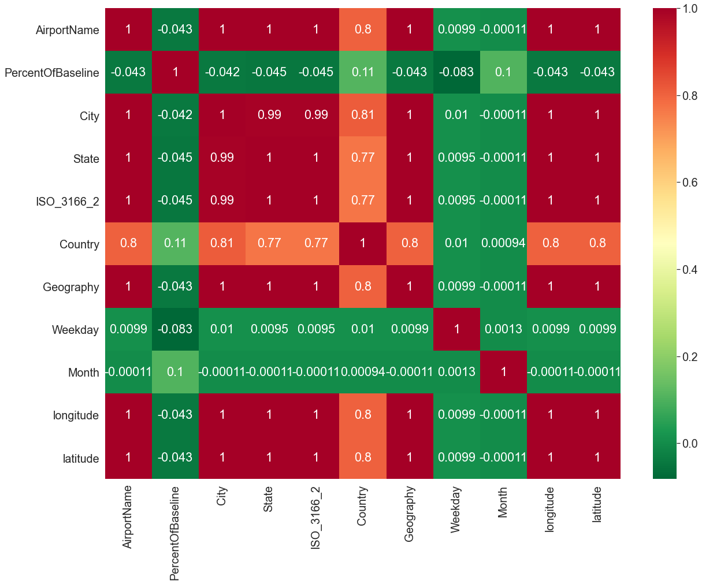
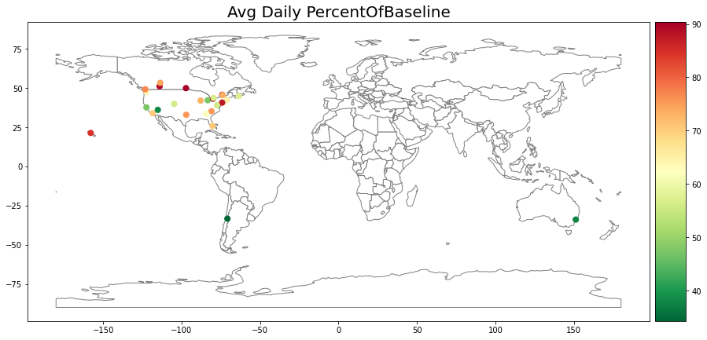

# Matthew Kwok Data Science Portfolio

# [Project 1 - Impact of COVID-19 on Global Airport Traffic](https://github.com/matt-kwok/covid_airport_impact_proj)
* Utilized GeoPandas, Contextily, Folium, and Plotly to leverage geospatial data and airport traffic data to create GIS maps of how COVID has influenced global airport traffic 
* Encoded categorical variables using Label-Encoding and One-Hot-Encoding methods to create correlation heatmaps to see if there was any relationships between the variables
* Implemented data wrangling and string RegEx techniques to clean, transform and manipulate a dataset of 7247 airport traffic entries from 27 airports 
* Analyzed time series data of airport traffic to analyze the change in airport traffic during the year of 2020

# [Project 2 - Creating an OLS Regression Model](https://github.com/matt-kwok/OLS_Regression_proj/blob/main/OLS_Regression_Modelling_Project.ipynb)
* Created an OLS regression model on an Excel file with multiple excel sheets
* Checked for linearity in the dataset by plotting correlation matrices 
* Optimized non-linear datasets by applying Box-Cox transformations to the datasets
* Utilized boxplots to find outliers affecting the performance of regression model
